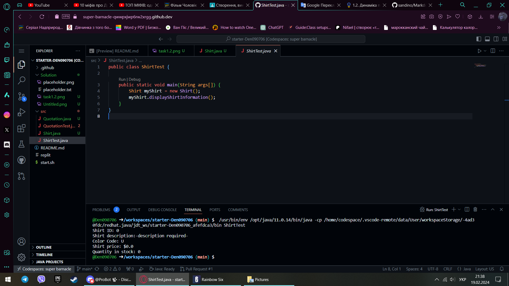
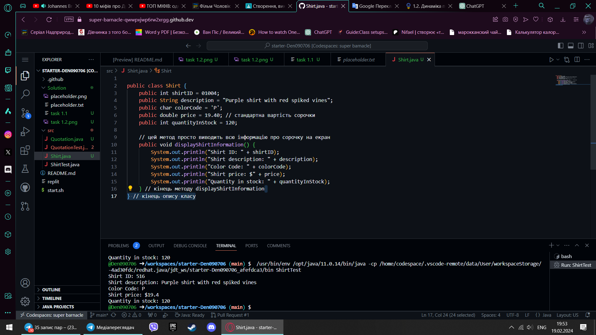

Завдання 1 - Сорочка
public class Shirt {
    public int shirtID = 01004; // додав рандомний іd 
    public String description = "Purple shirt with red spiked vines"; // додав опис
    public char colorCode = 'P'; // змінив з невизначеного на фіолетовий
    public double price = 19.40; // змінив вартість
    public int quantityInStock = 120; // збільшив кількість на складі

    public void displayShirtInformation() {
        System.out.println("Shirt ID: " + shirtID);
        System.out.println("Shirt description: " + description);
        System.out.println("Color Code: " + colorCode);
        System.out.println("Shirt price: $" + price);
        System.out.println("Quantity in stock: " + quantityInStock);
    } 
} 

